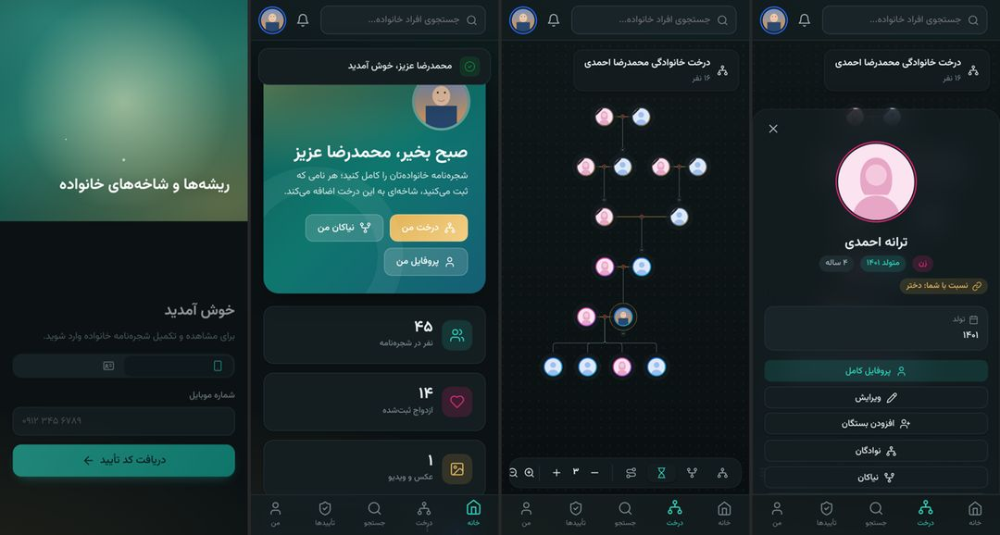

# 🌳 شجره‌نامه خانوادگی

وب‌اپ کامل ساخت شجره‌نامه با نمودار درختی زیبا و متحرک، اتصال درخت خانواده همسران، آلبوم عکس و ویدیو
با تأیید رأی‌گیری بستگان، خروجی PDF و چاپ، ورود با پیامک یا کد ملی، و اپ‌های اندروید و iOS با همان ظاهر.


| | |
|---|---|
|  |  |
|  |  |
|  |  |
|  |  |

---

## فهرست

- [قابلیت‌ها](#قابلیتها)
- [انتخاب فناوری‌ها](#انتخاب-فناوریها)
- [ساختار پروژه](#ساختار-پروژه)
- [اجرای سریع روی کامپیوتر](#اجرای-سریع-روی-کامپیوتر)
- [نصب روی سرور](#نصب-روی-سرور)
- [پنل پیامکی](#پنل-پیامکی)
- [قوانین دسترسی و تأیید عکس‌ها](#قوانین-دسترسی-و-تأیید-عکسها)
- [امنیت](#امنیت)
- [اپ‌های موبایل](#اپهای-موبایل)
- [شخصی‌سازی](#شخصیسازی)
- [تست‌ها](#تستها)

---

## قابلیت‌ها

### درخت
- **گره‌های دایره‌ای**: عکس پروفایل در دایره؛ نام روی قوس بالا و تاریخ تولد/وفات روی قوس پایین (ایستاده و خوانا). متن‌ها خودکار اندازه قوس می‌شوند. محتوای قوس‌ها از تنظیمات قابل تغییر است (نام، نام با عنوان، شهرت، محل تولد، شغل).
- **چهار نما**: نوادگان (از جد به پایین)، نیاکان (تا بالاترین جد ثبت‌شده)، ساعت شنی (هر دو)، و **مسیر نسبی** بین دو نفر (مثلاً از جد اعلا تا من).
- **چند همسر**: هر ازدواج جدا نمایش داده می‌شود و فرزندان هر ازدواج زیر همان ازدواج قرار می‌گیرند. طلاق با خط‌چین و قلب شکسته.
- **ازدواج فامیلی**: شخصی که در دو جای درخت آمده یک‌بار اصلی و یک‌بار با حلقه خط‌چین و دکمه «رفتن به جایگاه اصلی» نمایش داده می‌شود.
- **اتصال درخت همسران**: همسری را که در درخت خانواده پدری‌اش ثبت شده، به عنوان همسر وصل کنید؛ روی دایره او دکمه «درخت خانواده همسر» ظاهر می‌شود و نیاکانش تا جد اعلا قابل مشاهده است.
- **انیمیشن و جلوه‌ها**: رشد تدریجی شاخه‌ها، کشیده شدن خطوط، جابه‌جایی نرم هنگام باز و بسته کردن شاخه‌ها، هاله و مدار چرخان دور شخص انتخاب‌شده، برجسته شدن خطوط خویشاوندی با اشاره ماوس.
- **جابه‌جایی و بزرگ‌نمایی** با ماوس، چرخ ماوس، تاچ‌پد و دو انگشت (با اینرسی)، نقشه کوچک، جستجو داخل درخت، حالت تمام‌صفحه، میانبرهای صفحه‌کلید.
- **درخت‌های بسیار بزرگ**: رسم مجازی و نمای کلی سبک؛ درخت ۲۷۰۰ نفری در کمتر از نیم ثانیه باز می‌شود و روان (۶۰ فریم) جابه‌جا می‌شود.
- **نسبت خانوادگی**: محاسبه خودکار نسبت با اصطلاحات فارسی (پسرعمو، دخترخاله، مادرزن، باجناق، جاری، عروس، داماد، نتیجه، نبیره ...).
- ترتیب فرزندان راست‌به‌چپ (ارشد سمت راست) یا برعکس، حالت فشرده، تم روشن/تیره.

### خروجی و چاپ
- خروجی **PDF** تک‌صفحه (A4 تا A0، افقی/عمودی) یا **پوستری چندصفحه‌ای** برای چاپ بزرگ و چسباندن صفحات.
- **چاپ مستقیم** برداری (و «ذخیره به PDF» از پنجره چاپ با کیفیت نامحدود).
- خروجی **PNG** و **SVG** برداری.
- انتخاب محدوده: نمای فعلی، نوادگان یک نفر، **نیاکان من تا جد اعلا**، ساعت شنی، یا **از فلانی تا فلانی**؛ با عنوان، قاب تزئینی، تاریخ و گزینه سیاه‌وسفید.
- خروجی **GEDCOM** (استاندارد جهانی؛ قابل باز شدن در MyHeritage، Gramps، FamilySearch و ...).
- بدون کتابخانه سنگین: سازنده PDF داخلی کمتر از ۴ کیلوبایت است.

### اشخاص و مشخصات
- شناسه یکتای UUID برای همه روابط در بک‌اند + **کد کوتاه ۸ کاراکتری** قابل نمایش برای هر شخص.
- نام، نام خانوادگی، عنوان (حاج، سید، دکتر ...)، شهرت/لقب، جنسیت، ترتیب تولد، تاریخ و محل تولد، وفات، **محل دفن**، کد ملی، شماره و محل صدور شناسنامه، موبایل، ایمیل، شغل، تحصیلات، محل سکونت، زندگی‌نامه و خاطرات.
- **تاریخ شمسی جزئی**: فقط سال (۱۳۰۵) یا سال و ماه یا تاریخ کامل؛ مناسب شجره‌نامه‌های قدیمی.
- صفحه پروفایل با تب‌های مشخصات، گالری، بستگان و **تاریخچه تغییرات** (چه کسی چه چیزی را کی تغییر داد).
- عکس پروفایل با **برش دایره‌ای** قبل از آپلود.
- خاندان‌ها (نقطه‌های شروع درخت در صفحه اصلی)، مناسبت‌های پیش رو (تولد و سالگرد درگذشت)، آمار و فعالیت‌های اخیر.
- ادغام پروفایل‌های تکراری، سطل زباله و بازیابی (مدیر).

### عکس و ویدیو
- آپلود با کشیدن و رها کردن و نوار پیشرفت؛ گالری و نمایشگر تمام‌صفحه.
- **فشرده‌سازی خودکار بدون افت محسوس کیفیت**: تبدیل عکس به WebP (معمولاً ۳ تا ۱۰ برابر کم‌حجم‌تر)، ساخت نسخه‌های کوچک، حذف متادیتا (مثل مختصات GPS).
- ویدیو: تبدیل به MP4 سازگار با همه گوشی‌ها (H.264، حداکثر 720p) با ffmpeg در پس‌زمینه، ساخت پوستر، پخش با جلو/عقب بردن.
- **تأیید با رأی‌گیری بستگان** (جزئیات در [قوانین دسترسی](#قوانین-دسترسی-و-تأیید-عکسها)).

### ورود و حساب
- ورود با **موبایل و کد پیامکی** (با پرش خودکار خانه‌ها و پشتیبانی از چسباندن کد).
- ورود با **کد ملی و رمز عبور** (برای کسی که به شماره‌اش دسترسی ندارد؛ رمز را خودش یا والدینش هنگام ساخت پروفایل تعیین می‌کنند).
- ثبت‌نام با شماره جدید (قابل غیرفعال کردن)، تغییر شماره با تأیید پیامکی، مدیریت نشست‌ها و دستگاه‌ها.
- اعلان‌های داخل برنامه (+ پوش‌نوتیفیکیشن اپ موبایل با Firebase، اختیاری).

### ظاهر
- فارسی و راست‌به‌چپ کامل، فونت وزیرمتن (با اعداد فارسی)، تم روشن و تیره، کاملاً واکنش‌گرا با ناوبری پایین در موبایل.
- **سبک**: بدون jQuery و فریم‌ورک؛ کل جاوااسکریپت برنامه حدود ۸۵ کیلوبایت فشرده (gzip)، استایل ۱۱ کیلوبایت و فونت‌ها ۱۴۵ کیلوبایت — مجموعاً کمتر از ۲۵۰ کیلوبایت؛ صفحات به صورت تنبل بارگذاری می‌شوند. PWA قابل نصب روی گوشی.

---

## انتخاب فناوری‌ها

| بخش | انتخاب | چرا |
|---|---|---|
| بک‌اند | **PHP 8.3 + Laravel 13** | همان پیشنهاد شما؛ روی هر هاست ایرانی (حتی اشتراکی) اجرا می‌شود، اکوسیستم کامل (صف، زمان‌بند، اعتبارسنجی، رمزنگاری)، و ویرایشش برای شما آسان است. |
| API | **REST + JSON** با Laravel Sanctum | یک API مشترک برای وب، اندروید و iOS. وب با کوکی امن، اپ‌ها با توکن Bearer. |
| پایگاه داده | **MySQL 8 / MariaDB** (پیشنهادی)، PostgreSQL هم پشتیبانی می‌شود | سریع، رایج در همه هاست‌ها؛ پرس‌وجوهای درخت سطح‌به‌سطح و ایندکس‌شده‌اند. عکس و ویدیو **داخل پایگاه داده نیستند** بلکه روی دیسک (یا فضای ابری S3) ذخیره می‌شوند؛ این برای حجم بالا صحیح و سریع است. |
| فرانت‌اند | **جاوااسکریپت خالص (ES Modules) + SVG + CSS** | سبک‌ترین حالت ممکن و بدون مرحله build؛ فایل‌ها مستقیم قابل ویرایش‌اند. |
| اپ موبایل | **Java (اندروید) و Swift (iOS)** — پوسته بومی WebView + پل جاوااسکریپت | ظاهر دقیقاً مثل سایت، به‌روزرسانی فوری بدون انتشار نسخه جدید. همه داده‌ها از API در دسترس است تا در صورت نیاز صفحات بومی هم ساخته شوند. |

---

## ساختار پروژه

```
.
├── web/                       ← Laravel: API + وب‌اپ
│   ├── app/
│   │   ├── Http/Controllers/Api/   کنترلرهای API
│   │   ├── Models/                 مدل‌ها (Person, Marriage, Media, ...)
│   │   ├── Services/               منطق اصلی
│   │   │   ├── Access/PersonAccess.php      ← قوانین دسترسی بستگان
│   │   │   ├── Media/ApprovalService.php    ← رأی‌گیری تأیید عکس/ویدیو
│   │   │   ├── Media/ImageProcessor.php     ← فشرده‌سازی عکس
│   │   │   ├── People/                      ← ساخت اشخاص، بستگان، اتصال درخت‌ها، ادغام
│   │   │   ├── Tree/                        ← استخراج درخت، محاسبه نسبت، GEDCOM
│   │   │   ├── Sms/                         ← درایورهای پنل پیامکی
│   │   │   └── Auth/                        ← کد پیامکی و کپچا
│   │   ├── Support/                تقویم شمسی، کد ملی، موبایل، یکدست‌سازی متن فارسی
│   │   └── Jobs/ProcessVideo.php   فشرده‌سازی ویدیو
│   ├── config/pedigree.php    ← همه تنظیمات قابل تغییر برنامه
│   ├── database/migrations/   ساختار پایگاه داده
│   ├── public/assets/
│   │   ├── css/app.css        ← همه رنگ‌ها و ظاهر (متغیرهای بالای فایل)
│   │   └── js/
│   │       ├── core/          ابزار پایه (API، مسیریاب، تاریخ شمسی، اجزای رابط)
│   │       ├── tree/          چیدمان، رسم، بزرگ‌نمایی و خروجی درخت
│   │       ├── components/    اجزای مشترک
│   │       └── pages/         صفحات
│   └── tests/                 تست‌های خودکار
├── mobile/
│   ├── android/               اپ اندروید (Java)
│   └── ios/                   اپ iOS (Swift)
└── docs/
    ├── API.md                 مستندات کامل API
    └── DEPLOY.md              راهنمای نصب روی سرور
```

---

## اجرای سریع روی کامپیوتر

پیش‌نیاز: PHP 8.3+ با افزونه‌های `gd` و `sqlite3`، و Composer.

```bash
cd web
composer install
cp .env.example .env
php artisan key:generate
```

در `.env` برای اجرای محلی این مقادیر را تغییر دهید:

```ini
APP_ENV=local
APP_DEBUG=true
APP_URL=http://localhost:8000
DB_CONNECTION=sqlite
SESSION_SECURE_COOKIE=false
SANCTUM_STATEFUL_DOMAINS=localhost:8000,127.0.0.1:8000
SMS_DRIVER=log
```

```bash
touch database/database.sqlite
php artisan migrate
php artisan db:seed --class=DemoSeeder   # داده نمونه: ۵ نسل، دو خاندان
php artisan serve
```

مرورگر: `http://localhost:8000` ← ورود با **کد ملی `0012345679`** و **رمز `demo1234`**
(یا موبایل `09120000000`؛ در حالت توسعه کد پیامکی روی صفحه نمایش داده می‌شود).

برای ساخت مدیر واقعی (بدون داده نمونه): `php artisan pedigree:install`

---

## نصب روی سرور

راهنمای کامل (Nginx، هاست اشتراکی، cron، صف، ffmpeg، پشتیبان‌گیری، فضای ابری): [docs/DEPLOY.md](docs/DEPLOY.md)

خلاصه:
```bash
composer install --no-dev --optimize-autoloader
php artisan migrate --force
php artisan pedigree:install
# cron (الزامی):
* * * * * cd /path/web && php artisan schedule:run >> /dev/null 2>&1
```

---

## پنل پیامکی

پنل‌های زیر آماده‌اند؛ فقط نام درایور و کلیدها را در `.env` بنویسید. همه از **ارسال با قالب/پترن خدماتی** استفاده می‌کنند
(سریع‌ترین روش، بدون نیاز به خط اختصاصی و بدون فیلتر مخابرات برای کد تأیید):

| پنل | `SMS_DRIVER` | تنظیمات |
|---|---|---|
| **کاوه‌نگار** (پیشنهاد اول) | `kavenegar` | `KAVENEGAR_API_KEY`، `KAVENEGAR_OTP_TEMPLATE` (قالب Verify با متغیر `%token`) |
| **SMS.ir** (پیشنهاد دوم) | `smsir` | `SMSIR_API_KEY`، `SMSIR_OTP_TEMPLATE_ID`، `SMSIR_OTP_PARAMETER` |
| ملی‌پیامک | `melipayamak` | `MELIPAYAMAK_USERNAME`، `MELIPAYAMAK_PASSWORD`، `MELIPAYAMAK_BODY_ID` |
| فراز اس‌ام‌اس / IPPanel | `ippanel` | `IPPANEL_API_KEY`، `IPPANEL_PATTERN_CODE`، `IPPANEL_SENDER` |
| قاصدک | `ghasedak` | `GHASEDAK_API_KEY`، `GHASEDAK_OTP_TEMPLATE` |
| حالت توسعه | `log` | کد در `storage/logs/laravel.log` نوشته می‌شود |

متن پیشنهادی قالب: `کد ورود شما به شجره‌نامه خانوادگی: %token`

برای افزودن پنل دیگر: یک کلاس در `web/app/Services/Sms/Drivers` بسازید (حدود ۱۵ خط، از روی نمونه‌ها) و در `SmsManager` ثبت کنید.
پیش از انتشار، آدرس و پارامترهای API را با مستندات فعلی پنل انتخابی تطبیق دهید.

محافظت از شارژ پنل: فاصله ۶۰ ثانیه بین درخواست‌ها، سقف روزانه برای هر شماره، سقف ساعتی برای هر IP، و **کپچای تصویری** بعد از چند درخواست.

---

## قوانین دسترسی و تأیید عکس‌ها

همه این قوانین در `web/config/pedigree.php` قابل تغییرند.

### چه کسی می‌تواند مشخصات یک شخص را ویرایش کند؟
1. **خود شخص**
2. **بستگان درجه یک**: پدر و مادر (مثلاً ساخت پروفایل فرزند)، فرزندان، خواهر و برادرها، همسر
3. اگر شخص **درگذشته** باشد: همه نوادگانش تا ۶ نسل (نوه، نتیجه ...)
4. **سازنده پروفایل**، تا وقتی صاحب پروفایل خودش وارد سیستم نشده
5. مدیران

- اگر شخص **«قفل پروفایل»** را روشن کند، فقط خودش و مدیر می‌توانند ویرایش کنند.
- **اطلاعات حساس** (کد ملی، شناسنامه، موبایل، رمز) شخصی که حساب فعال دارد فقط در اختیار خودش است؛ بقیه حتی نمی‌بینند.
- ثبت درگذشتِ عضوی که حساب فعال دارد فقط با مدیر است (تا کسی نتواند حساب دیگری را قفل کند).
- هر ویرایش در تاریخچه ثبت می‌شود و صاحب پروفایل اعلان «پروفایل شما ویرایش شد» می‌گیرد.

### تأیید عکس و ویدیو (جلوگیری از انتشار محتوای نامناسب)
| وضعیت صاحب پروفایل | چه کسی تصمیم می‌گیرد |
|---|---|
| خودش آپلود کرده | تأیید خودکار |
| زنده و دارای حساب فعال | **فقط خودش** |
| درگذشته | **رأی‌گیری بین فرزندان**؛ اگر فرزند عضوی نداشت ← خواهر و برادرها ← همسران ← والدین |
| زنده بدون حساب (کودک، سالمند) | رأی‌گیری بین والدین ← خواهر و برادرها ← فرزندان ← همسران |
| هیچ رأی‌دهنده‌ای نیست | مدیر |

- تأیید با **اکثریت مطلق** (بیش از نصف رأی‌دهندگان)؛ وقتی رسیدن به اکثریت ناممکن شود، رد می‌شود.
- آپلودکننده خودش رأی نمی‌دهد. تا تأیید نشده، فایل فقط برای آپلودکننده، رأی‌دهندگان و مدیر قابل دیدن است.
- فایل‌های **ردشده کاملاً حذف** می‌شوند. رأی‌گیری‌هایی که ۱۴ روز طول بکشد خودکار جمع‌بندی می‌شوند.
- مدیر می‌تواند مستقیماً تأیید یا رد کند.

### اتصال درخت‌ها
اتصال یک شخص موجود (همسر، پدر، مادر یا فرزند از درخت دیگر) اگر به طرف مقابل دسترسی ویرایش نداشته باشید،
به صورت «درخواست اتصال» ثبت می‌شود و یکی از بستگانِ طرف مقابل باید تأییدش کند. از ایجاد دور در درخت
(مثلاً شخصی جد خودش شود) و ازدواج جد و نواده جلوگیری می‌شود.

---

## امنیت

- **رمزنگاری** کد ملی، شماره شناسنامه و موبایل در پایگاه داده (AES-256) + «ایندکس کور» HMAC برای جستجو.
- کد پیامکی فقط به صورت هش ذخیره می‌شود، ۲ دقیقه اعتبار و حداکثر ۵ بار امتحان دارد؛ کدهای قبلی با ارسال کد جدید باطل می‌شوند.
- قفل موقت پس از رمزهای اشتباه (هم برای «کد ملی + IP» و هم برای کد ملی از هر IP)، زمان پاسخ یکسان برای جلوگیری از کشف حساب‌ها، پیام یکسان برای شماره‌های ثبت‌شده و نشده.
- وقتی صاحب واقعی شماره با پیامک وارد شود، **رمزی که دیگران برای حسابش گذاشته‌اند پاک و همه نشست‌های قبلی بسته می‌شوند**.
- سشن کوکی **httpOnly/Secure/SameSite** و محافظت CSRF برای وب؛ توکن‌های زمان‌دار و قابل ابطال برای اپ‌ها.
- **CSP سخت‌گیرانه با nonce** (فقط اسکریپت‌های خود سایت)، X-Frame-Options، HSTS، Referrer-Policy، Permissions-Policy.
- جلوگیری از XSS: رابط کاربری هیچ داده کاربری را به صورت HTML درج نمی‌کند.
- عکس‌ها **از نو کدگذاری** می‌شوند (فایل‌های مخرب جاسازی‌شده از بین می‌روند) و متادیتا حذف می‌شود؛ نوع فایل از محتوا تشخیص داده می‌شود نه پسوند.
- فایل‌ها خارج از پوشه عمومی و فقط با **لینک امضاشده زمان‌دار** قابل دسترسی‌اند.
- محدودیت نرخ درخواست برای همه API، کپچای ضد اسپم پیامکی، لاگ ممیزی کامل (IP، دستگاه، تغییرات).
- حذف نرم اشخاص (قابل بازیابی)، مسدودسازی کاربر، نقش‌های مدیر کل / مدیر / عضو.

---

## اپ‌های موبایل

- اندروید (Java): [mobile/android](mobile/android/README.md)
- iOS (Swift): [mobile/ios](mobile/ios/README.md)

هر دو همان وب‌اپ را با همان ظاهر نمایش می‌دهند و ذخیره PDF، چاپ، اشتراک‌گذاری، دوربین و
لینک‌های سایت را به صورت بومی پشتیبانی می‌کنند. کافی است آدرس سایت را در تنظیمات هر پروژه وارد کنید.
مستندات API برای ساخت صفحات بومی: [docs/API.md](docs/API.md)

---

## شخصی‌سازی

| می‌خواهید... | کجا |
|---|---|
| رنگ‌ها و ظاهر را عوض کنید | متغیرهای ابتدای `web/public/assets/css/app.css` |
| قوانین دسترسی، رأی‌گیری، طول کد پیامکی، حجم فایل‌ها | `web/config/pedigree.php` |
| نام سایت | `PEDIGREE_SITE_NAME` در `.env` |
| اندازه دایره‌ها و فاصله‌های درخت | تابع `geometry` در `web/public/assets/js/tree/layout.js` |
| شکل گره‌ها و متن‌های روی قوس | `web/public/assets/js/tree/node.js` |
| اصطلاحات نسبت‌های خانوادگی | `web/app/Services/Tree/RelationshipCalculator.php` |
| برچسب‌های فارسی | `web/public/assets/js/components/labels.js` و `web/lang/fa` |

تغییر فایل‌های JS/CSS بلافاصله اعمال می‌شود (نسخه‌گذاری خودکار؛ نیازی به build نیست).

---

## تست‌ها

```bash
cd web
php artisan test
```

تست‌ها ورود پیامکی و رمزی، قفل حساب، ثبت‌نام، رمزنگاری، ساخت بستگان و درخت، نسبت‌های خانوادگی،
دسترسی‌ها، اتصال درخت‌ها با تأیید، جلوگیری از دور، ادغام، رأی‌گیری عکس، حذف فایل ردشده، لینک امضاشده
و هدرهای امنیتی را پوشش می‌دهند.

---

فونت [وزیرمتن](https://github.com/rastikerdar/vazirmatn) تحت مجوز SIL Open Font License.
