# 🌳 شجره‌نامه خانوادگی

وب‌اپ کامل و **متن‌باز** ساخت شجره‌نامه با نمودار درختی زیبا و متحرک، پروفایل کامل هر نفر (تحصیلات، شغل،
محل زندگی روی نقشه، رزومه، زندگی‌نامه با نام نویسنده هر کلمه)، نظرسنجی خاندان، استوری، اتصال درخت خانواده
همسران، آلبوم عکس و ویدیو با تأیید رأی‌گیری بستگان، **خروجی PDF برداری در هر اندازه (تا بنر ۱۰×۵ متری)**،
ورود با پیامک، کد ملی یا نام کاربری، و اپ‌های اندروید و iOS با همان ظاهر.

> English summary: [below](#english)

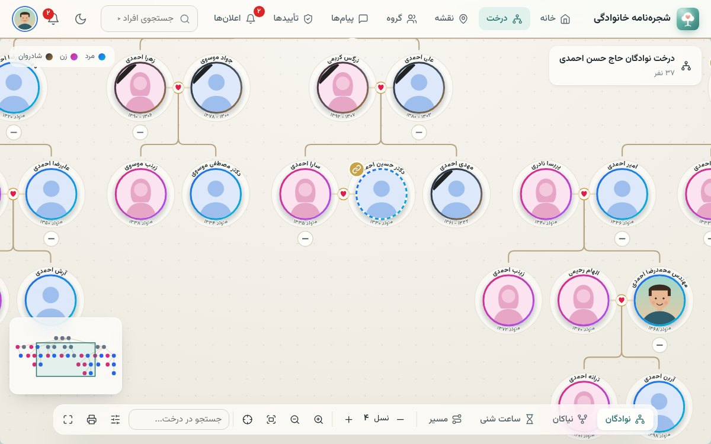

| | |
|---|---|
| 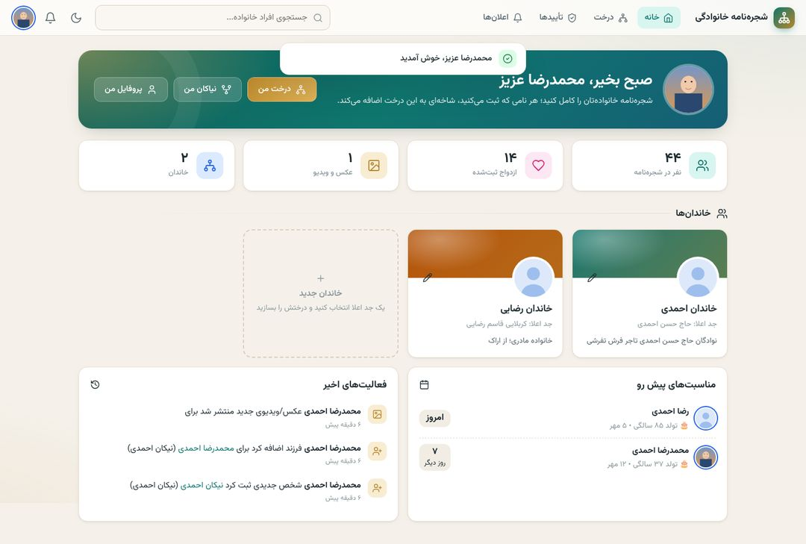 | 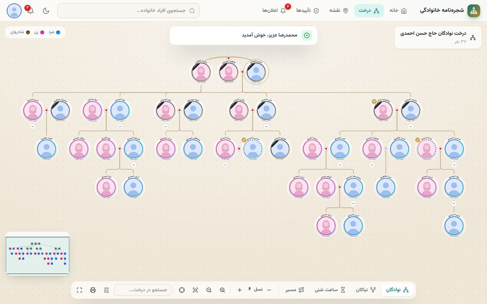 |
| 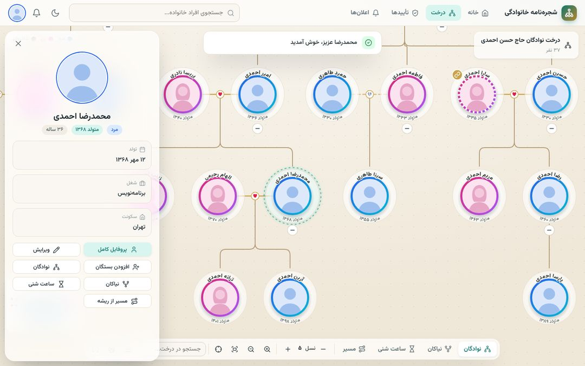 | 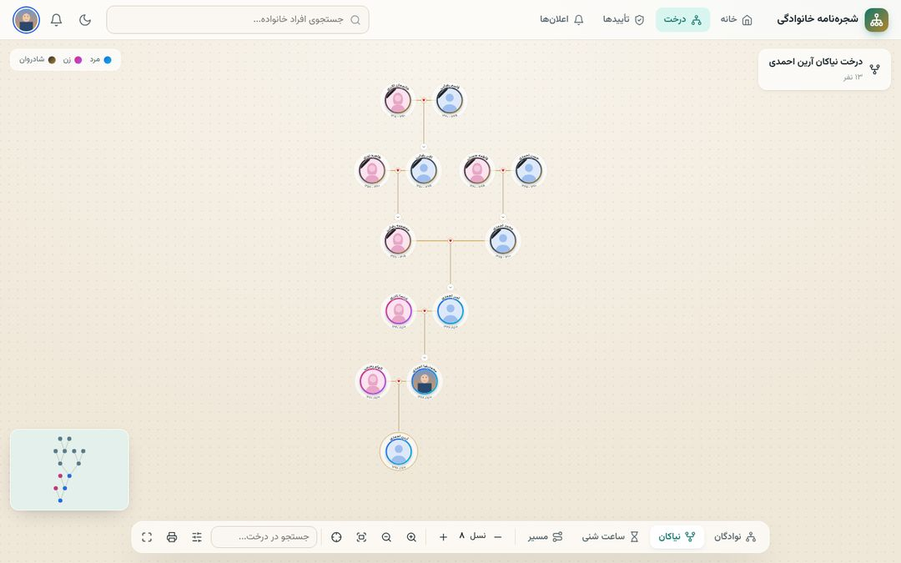 |
| 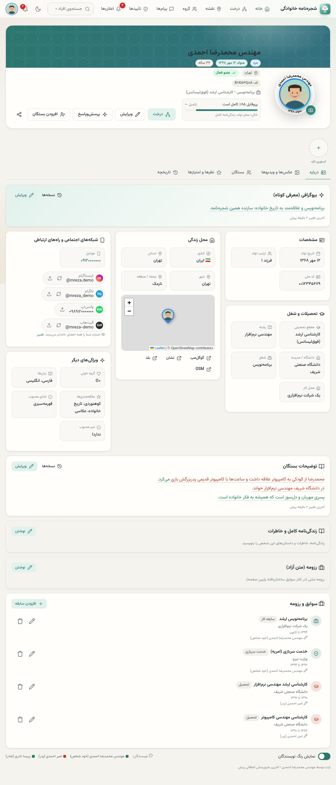 | 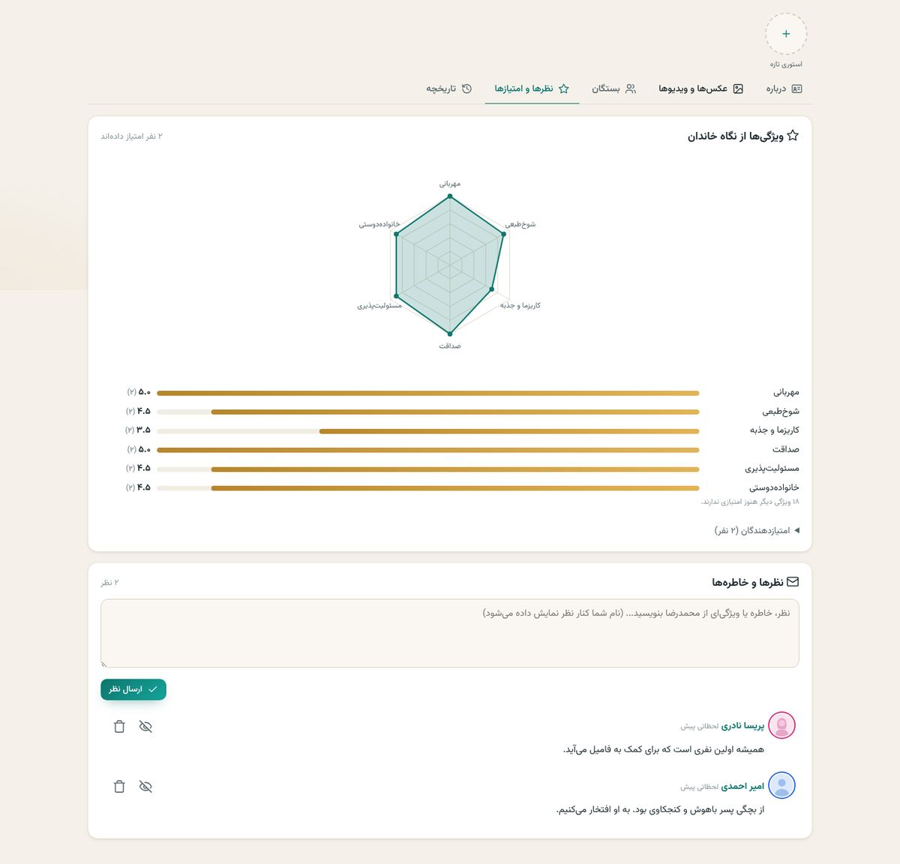 |
| 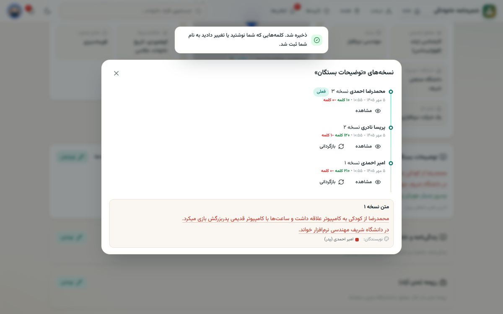 | 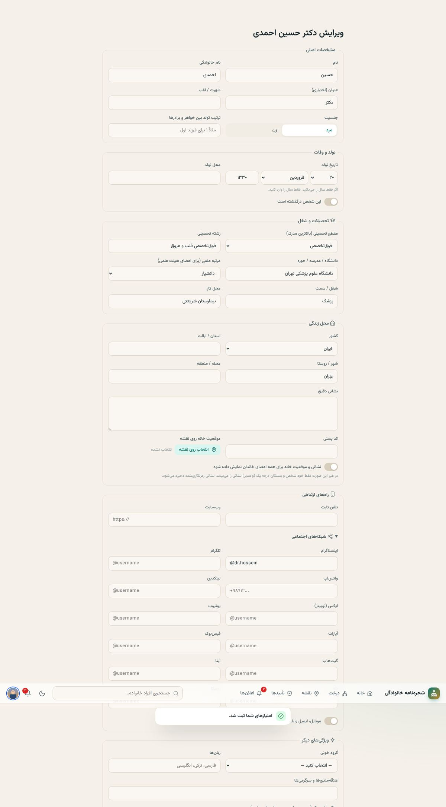 |
| 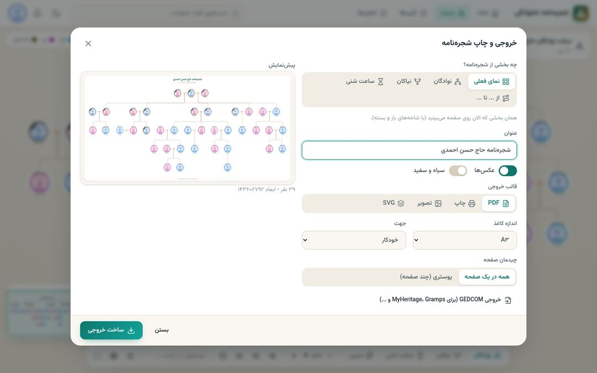 | 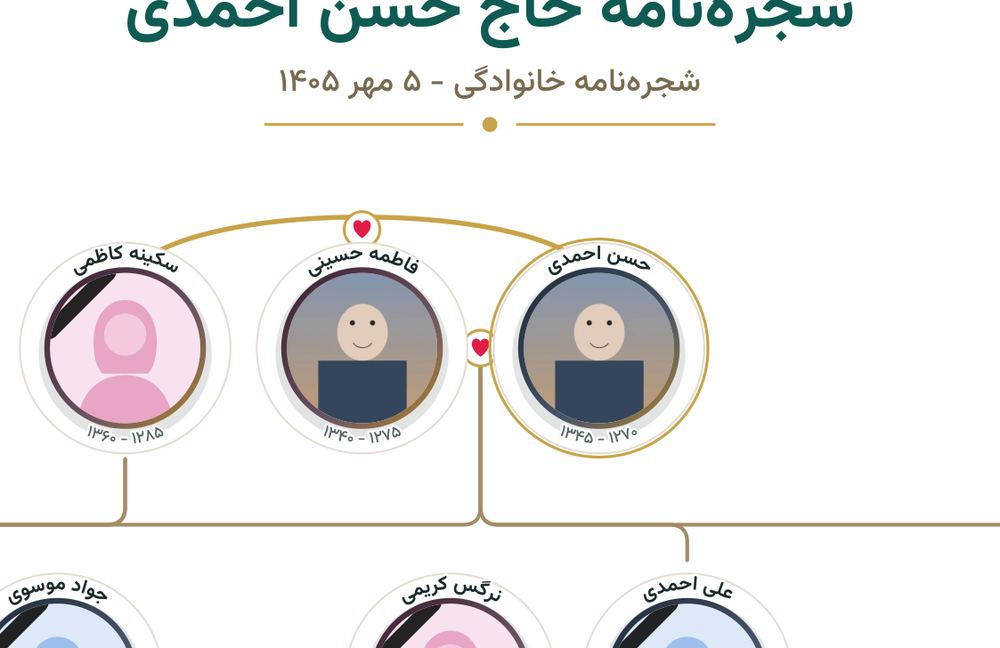 |
| 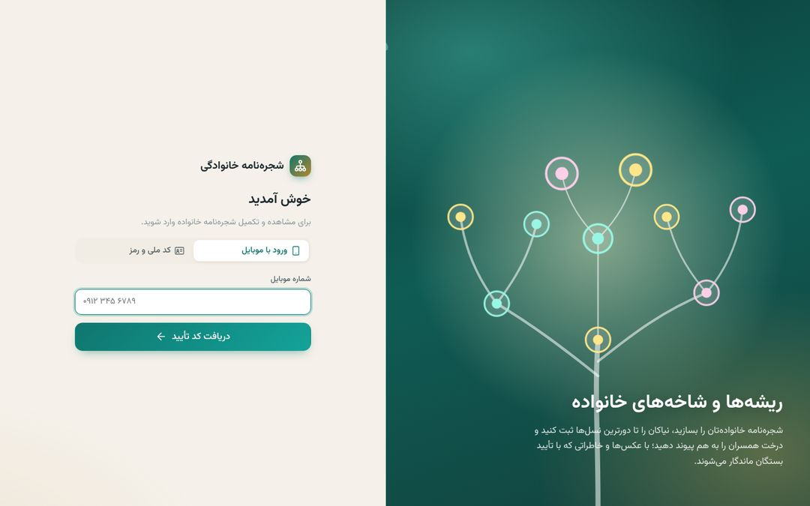 | 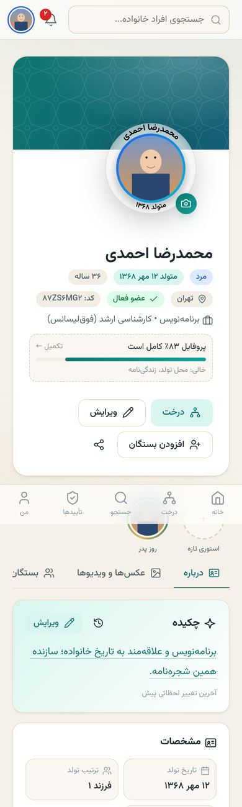 |

---

## فهرست

- [قابلیت‌ها](#قابلیتها)
- [انتخاب فناوری‌ها](#انتخاب-فناوریها)
- [ساختار پروژه](#ساختار-پروژه)
- [اجرای سریع روی کامپیوتر](#اجرای-سریع-روی-کامپیوتر)
- [نصب روی سرور](#نصب-روی-سرور)
- [پنل پیامکی](#پنل-پیامکی)
- [پیام‌رسان اعضا](#پیامرسان-اعضا)
- [دستیار هوش مصنوعی](#دستیار-هوش-مصنوعی)
- [قوانین دسترسی و تأیید عکس‌ها](#قوانین-دسترسی-و-تأیید-عکسها)
- [امنیت](#امنیت)
- [اپ‌های موبایل](#اپهای-موبایل)
- [شخصی‌سازی](#شخصیسازی)
- [تست‌ها](#تستها)
- [مجوز و مشارکت](#مجوز-و-مشارکت)
- [English](#english)

---

## قابلیت‌ها

### درخت
- **گره‌های دایره‌ای**: عکس پروفایل در دایره؛ نام (با عنوان خودکار «دکتر» یا «مهندس») روی قوس بالا و تاریخ تولد/وفات روی قوس پایین (ایستاده و خوانا). متن‌ها نسبت به عکس کوچک و **چسبیده به بیرون حلقه** هستند (فاصله از روی اندازه حروف حساب می‌شود) و خودکار اندازه قوس می‌شوند. محتوای قوس‌ها قابل تغییر است (نام، نام با عنوان، شهرت، محل تولد، شغل، تحصیلات، شهر).
- **مناسب چاپ دیواری**: فاصله همسران و خواهر/برادرها کم و فاصله شاخه‌های خانواده‌های مختلف بیشتر؛ خانواده‌ها از هم جدا ولی درون خود فشرده‌اند (برای درخت‌های هزار نفری).
- **چهار نما**: نوادگان (از جد به پایین)، نیاکان (تا بالاترین جد ثبت‌شده)، ساعت شنی (هر دو)، و **مسیر نسبی** بین دو نفر (مثلاً از جد اعلا تا من).
- **چند همسر (زن یا شوهر)**: همسران به ترتیب ازدواج در یک ردیف می‌آیند؛ **همسر اول نزدیک‌ترین، دومی کنار او، سومی بعدی** (ترتیب از فیلد «ترتیب» یا تاریخ ازدواج). فرزندان هر ازدواج زیر همان ازدواج قرار می‌گیرند. طلاق با خط‌چین و قلب خاکستری.
- **ازدواج فامیلی**: شخصی که در دو جای درخت آمده یک‌بار اصلی و یک‌بار با حلقه خط‌چین و دکمه «رفتن به جایگاه اصلی» نمایش داده می‌شود.
- **اتصال درخت همسران**: همسری را که در درخت خانواده پدری‌اش ثبت شده، به عنوان همسر وصل کنید؛ روی دایره او دکمه «درخت خانواده همسر» ظاهر می‌شود و نیاکانش تا جد اعلا قابل مشاهده است.
- **انیمیشن و جلوه‌ها**: رشد تدریجی شاخه‌ها، کشیده شدن خطوط، جابه‌جایی نرم هنگام باز و بسته کردن شاخه‌ها، هاله و مدار چرخان دور شخص انتخاب‌شده، برجسته شدن خطوط خویشاوندی با اشاره ماوس.
- **جابه‌جایی و بزرگ‌نمایی** با ماوس، چرخ ماوس، تاچ‌پد و دو انگشت (با اینرسی)، نقشه کوچک، جستجو داخل درخت، حالت تمام‌صفحه، میانبرهای صفحه‌کلید.
- **درخت‌های بسیار بزرگ**: رسم مجازی و نمای کلی سبک؛ درخت ۲۷۰۰ نفری در کمتر از نیم ثانیه باز می‌شود و روان (۶۰ فریم) جابه‌جا می‌شود.
- **نسبت خانوادگی**: محاسبه خودکار نسبت با اصطلاحات فارسی (پسرعمو، دخترخاله، مادرزن، باجناق، جاری، عروس، داماد، نتیجه، نبیره ...).
- ترتیب فرزندان راست‌به‌چپ (ارشد سمت راست) یا برعکس، حالت فشرده، تم روشن/تیره.

### خروجی و چاپ
- **PDF کاملاً برداری** (بدون افت کیفیت در هر بزرگنمایی): A4 تا A0 یا **اندازه دلخواه به سانتی‌متر/متر** (مثلاً بنر ۱۰×۵ متر؛ بزرگ‌تر از ۵ متر با UserUnit)، یا تقسیم همان اندازه نهایی روی **برگه‌های A4/A3** با هم‌پوشانی و علامت برش برای چسباندن. متن فارسی با فونت جاسازی‌شده، حروف چسبان و راست‌به‌چپ است و در PDF قابل جستجو و کپی است. پنجره خروجی اندازه واقعی چاپ و قطر عکس هر نفر را نشان می‌دهد.
- خروجی PDF تصویری (سازگار با همه نرم‌افزارها) تک‌صفحه یا پوستری.
- **چاپ مستقیم** برداری (و «ذخیره به PDF» از پنجره چاپ با کیفیت نامحدود).
- خروجی **PNG** و **SVG** برداری.
- انتخاب محدوده: نمای فعلی، نوادگان یک نفر، **نیاکان من تا جد اعلا**، ساعت شنی، یا **از فلانی تا فلانی**؛ با عنوان، قاب تزئینی، تاریخ و گزینه سیاه‌وسفید.
- **انتخاب سریع برای خاندان‌های بزرگ** (هزاران نفر): «خانواده من»، «از پدر و مادرم به پایین»، «از پدربزرگ پدری/مادری به پایین»، «نیاکان من/پدرم/مادرم»، «کل خاندان از جد اعلا»؛ و دکمه **«چاپ از این شخص»** روی هر دایره. برای خاندان‌های پهن، اندازه چاپ خوانا (مثلاً بنر ۱۳ متری) پیشنهاد می‌شود. خروجی ۱۸۰۰ نفره در چند ثانیه ساخته می‌شود.
- خروجی **GEDCOM** (استاندارد جهانی؛ قابل باز شدن در MyHeritage، Gramps، FamilySearch و ...).
- بدون کتابخانه سنگین: سازنده PDF برداری (خواندن فونت TrueType، اتصال حروف فارسی، گرادیان، عکس) داخلی است و فونت‌ها فقط هنگام ساخت خروجی دانلود می‌شوند.

### پروفایل کامل
- **همه فیلدها اختیاری** (جز نام): عنوان، شهرت، تاریخ و محل تولد/وفات، محل دفن و **موقعیت مزار روی نقشه**، کد ملی، شناسنامه، موبایل، ایمیل.
- **تحصیلات**: مقطع (از بی‌سواد و مکتب‌خانه تا دیپلم، لیسانس، فوق‌لیسانس، دکترا، تخصص، فوق‌تخصص، فلوشیپ، پسادکترا و سطوح حوزوی)، گروه و رشته، دانشگاه، **مرتبه علمی** (مربی تا استاد تمام/پروفسور).
- **عنوان خودکار «دکتر» و «مهندس»** پیش از نام در پروفایل، روی دایره درخت و در چاپ: «دکتر» برای دکترای حرفه‌ای (پزشکی، دندان‌پزشکی ...)، دکترای تخصصی و بالاتر و اعضای هیئت علمی (استادیار به بالا)؛ «مهندس» فقط برای لیسانس و فوق‌لیسانس رشته‌های فنی و مهندسی، معماری و مهندسی کشاورزی — **هرگز برای پرستاری، پیراپزشکی و رشته‌های غیرفنی**. ترتیب با عنوان دستی درست است («حاج دکتر ...»، «دکتر سید ...») و قابل خاموش کردن است.
- **شغل و محل کار**، **رزومه ساختاریافته** (تحصیل، کار، سربازی، جایزه، گواهی، کتاب و مقاله، مهارت، فعالیت داوطلبانه، سفر و مهاجرت) به صورت خط زمانی.
- **محل زندگی**: کشور (همه کشورها با نام فارسی؛ برای بستگان خارج از ایران)، استان، شهر، محله، نشانی دقیق، کد پستی و **موقعیت خانه روی نقشه** (با «موقعیت من»، لینک مسیریابی گوگل‌مپ/نشان/بلد). نشانی و موقعیت رمزنگاری‌شده است.
- **شبکه‌های اجتماعی** (اول اینستاگرام، تلگرام و واتس‌اپ؛ سپس ایتا، بله، روبیکا، سروش، لینکدین، ایکس، تردز، تیک‌تاک، یوتیوب، آپارات، فیس‌بوک، اسنپ‌چت، پینترست، گیت‌هاب، ویراستی، بلواسکای): هر شکلی (لینک کامل، ‎@شناسه یا شماره) وارد شود، شناسه استاندارد ذخیره و **لینک مستقیم** ساخته می‌شود (wa.me برای واتس‌اپ، t.me/+شماره برای تلگرام). هنگام تایپ پیش‌نمایش نام و عکس پروفایل عمومی نشان داده می‌شود؛ در پروفایل با کلیک روی عکس‌ها، **عکس پروفایل همه شبکه‌ها یکی‌یکی** دیده می‌شود. اگر شخص در سایت عکس ندارد، عکس شبکه‌ها به ترتیب **اینستاگرام ← واتس‌اپ ← تلگرام** عکس پروفایل او می‌شود.
- **چه کسانی شماره و نشانی را ببینند** (به انتخاب خود شخص): همه اعضای شجره‌نامه (پیش‌فرض برای شماره)، بستگان تا درجه ۴، ۳، ۲، ۱ (پیش‌فرض برای نشانی) یا فقط خودش؛ دکمه **«دقیقاً چه کسانی؟»** فهرست بستگان هر درجه را با نام نسبت (عمو، پسرخاله، پدرزن ...) نشان می‌دهد.
- تلفن ثابت، وب‌سایت، گروه خونی، زبان‌ها، علاقه‌مندی‌ها و **ویژگی‌های دلخواه نامحدود** («غذای محبوب: قورمه‌سبزی»).
- **پرسش‌نامه تکمیل پروفایل**: یک سؤال در هر صفحه با زبان ساده (مناسب سالمندان و موبایل)؛ از اینستاگرام و تلگرام و واتس‌اپ شروع می‌شود و تا چیزهایی که به ذهن کسی نمی‌رسد می‌رود (غذا و شاعر محبوب، ساز و مهارت، لقب کودکی، اولین شغل، خاطره، آرزو، توصیه به نسل‌های بعد، نام پدر و مادر ...).
- **بیوگرافی، توضیحات بستگان، زندگی‌نامه و رزومه متنی** که خود شخص و بستگان درجه یکش می‌نویسند؛ **نام نویسنده هر کلمه ثبت می‌شود**: هر نویسنده با یک رنگ نمایش داده می‌شود (حتی اصلاح یک غلط املایی رنگ همان کلمه را عوض می‌کند) و راهنمای کوچک رنگ‌ها در پایین صفحه است (مثلاً قرمز = علی (پسر)، سبز = مریم (دختر)، مشکی = مدیر). همه نسخه‌ها با «+/- کلمه» نگه داشته می‌شوند و قابل بازگردانی‌اند؛ ویرایش هم‌زمان دو نفر باعث پاک شدن نوشته کسی نمی‌شود.
- کنار هر مشخصه هم رنگ آخرین ویرایشگرش؛ **درصد تکمیل پروفایل** برای تشویق به تکمیل.
- **نظرسنجی خاندان**: همه اعضا به ویژگی‌های هر نفر (مهربانی، شوخ‌طبعی، کاریزما، صداقت، دست‌پخت و ۲۰ ویژگی دیگر؛ قابل تغییر) از ۱ تا ۵ امتیاز می‌دهند (نمودار راداری، میانگین، توزیع، نام امتیازدهندگان) و **نظر و خاطره** با نام خود می‌نویسند؛ خود شخص و بستگان درجه یک نظر نامناسب را مخفی می‌کنند.
- **استوری**: گرفتن عکس یا فیلم همان لحظه با دوربین گوشی (یا وب‌کم کامپیوتر) و ارسال؛ برای همیشه در پروفایل می‌ماند و با نمایشگر تمام‌صفحه دیده می‌شود.
- **نقشه خاندان**: محل زندگی اعضا (طبق تنظیم خودشان) و آرامگاه درگذشتگان روی یک نقشه.
- **تاریخچه کامل** برای همه اعضا: چه کسی کی چه چیزی را اضافه، حذف یا ویرایش کرد (مشخصات، متن‌ها، رزومه، عکس و استوری، نظر، امتیاز)؛ مقادیر محرمانه ماسک می‌شوند و ورودها فقط برای خود شخص و مدیر است.
- شناسه یکتای UUID + **کد کوتاه ۸ کاراکتری** برای هر شخص؛ **تاریخ شمسی جزئی** (فقط سال، سال و ماه، یا کامل).
- خاندان‌ها، مناسبت‌های پیش رو (تولد و سالگرد درگذشت)، آمار و فعالیت‌های اخیر؛ ادغام پروفایل‌های تکراری، سطل زباله و بازیابی (مدیر).

### عکس و ویدیو
- آپلود با کشیدن و رها کردن و نوار پیشرفت؛ گالری و نمایشگر تمام‌صفحه.
- **فشرده‌سازی خودکار بدون افت محسوس کیفیت (مثل تلگرام و اینستاگرام)**:
  - عکس‌های بزرگ **پیش از آپلود در خود گوشی/مرورگر** به حداکثر ۲۵۶۰ پیکسل کوچک می‌شوند (اینترنت کمتر، آپلود سریع‌تر)؛
    سرور دوباره به WebP با کیفیت ۸۵ تبدیل می‌کند (معمولاً ۳ تا ۱۰ برابر کم‌حجم‌تر)، نسخه‌های کوچک می‌سازد و متادیتا (مثل مختصات GPS) را حذف می‌کند.
  - ویدیو با ffmpeg در پس‌زمینه به MP4 (H.264 + AAC) با **ضلع کوچک‌تر ۷۲۰ پیکسل** (ویدیوی عمودی گوشی 720×1280 می‌ماند)،
    **حداکثر ۳۰ فریم**، CRF ۲۶ با سقف بیت‌ریت و صدای ۹۶ کیلوبیت تبدیل می‌شود — معمولاً ۵ تا ۱۰ برابر کم‌حجم‌تر؛
    اگر فایل اصلی از قبل بهینه بوده، **هرگز بزرگ‌تر نمی‌شود**. متادیتا (موقعیت مکانی، عنوان) حذف و **فایل اصلی پس از تبدیل پاک** می‌شود.
  - سقف حجم عکس و ویدیو، مدت ویدیو، وضوح (۴۸۰/۷۲۰/۱۰۸۰) و میزان فشرده‌سازی از پنل مدیریت قابل تنظیم است؛
    فایل بزرگ‌تر از سقف پیش از آپلود رد می‌شود.
- پوستر ویدیو، پخش با جلو/عقب بردن.
- **تأیید با رأی‌گیری بستگان** (جزئیات در [قوانین دسترسی](#قوانین-دسترسی-و-تأیید-عکسها)).

### ورود و حساب
- ورود با **موبایل و کد پیامکی** (با پرش خودکار خانه‌ها و پشتیبانی از چسباندن کد).
- ورود با **رمز عبور** و یکی از: کد ملی، **نام کاربری** یا موبایل. برای پدربزرگ و مادربزرگی که کد ملی یا موبایل ندارند (فقط شماره شناسنامه یا هیچ)، فرزندان یا مدیر **نام کاربری و رمز** تعیین می‌کنند.
- ثبت‌نام فقط با **موبایل تأییدشده + کد ملی** (با گزینه «کد ملی ایرانی ندارم» برای ساکنان خارج؛ قابل تنظیم). کد ملی به‌تنهایی هرگز برای تصاحب پروفایل موجود کافی نیست.
- تغییر شماره با تأیید پیامکی، مدیریت نشست‌ها و دستگاه‌ها.
- اعلان‌های داخل برنامه (+ پوش‌نوتیفیکیشن اپ موبایل با Firebase، اختیاری).
- **پیام‌رسان اعضا** (فقط متن و ایموجی) و **دستیار هوش مصنوعی** — جزئیات پایین‌تر.

### ظاهر
- فارسی و راست‌به‌چپ کامل، فونت وزیرمتن (با اعداد فارسی)، تم روشن و تیره، کاملاً واکنش‌گرا با ناوبری پایین در موبایل.
- **سبک**: بدون jQuery و فریم‌ورک؛ کل جاوااسکریپت برنامه حدود ۸۵ کیلوبایت فشرده (gzip)، استایل ۱۱ کیلوبایت و فونت‌ها ۱۴۵ کیلوبایت — مجموعاً کمتر از ۲۵۰ کیلوبایت؛ صفحات به صورت تنبل بارگذاری می‌شوند. PWA قابل نصب روی گوشی.

---

## انتخاب فناوری‌ها

| بخش | انتخاب | چرا |
|---|---|---|
| بک‌اند | **PHP 8.3 + Laravel 13** | همان پیشنهاد شما؛ روی هر هاست ایرانی (حتی اشتراکی) اجرا می‌شود، اکوسیستم کامل (صف، زمان‌بند، اعتبارسنجی، رمزنگاری)، و ویرایشش برای شما آسان است. |
| API | **REST + JSON** با Laravel Sanctum | یک API مشترک برای وب، اندروید و iOS. وب با کوکی امن، اپ‌ها با توکن Bearer. |
| پایگاه داده | **MySQL 8 / MariaDB** (پیشنهادی)، PostgreSQL هم پشتیبانی می‌شود | سریع، رایج در همه هاست‌ها؛ پرس‌وجوهای درخت سطح‌به‌سطح و ایندکس‌شده‌اند. عکس و ویدیو **داخل پایگاه داده نیستند** بلکه روی دیسک (یا فضای ابری S3) ذخیره می‌شوند؛ این برای حجم بالا صحیح و سریع است. |
| فرانت‌اند | **جاوااسکریپت خالص (ES Modules) + SVG + CSS** | سبک‌ترین حالت ممکن و بدون مرحله build؛ فایل‌ها مستقیم قابل ویرایش‌اند. |
| اپ موبایل | **Java (اندروید) و Swift (iOS)** — پوسته بومی WebView + پل جاوااسکریپت | ظاهر دقیقاً مثل سایت، به‌روزرسانی فوری بدون انتشار نسخه جدید. همه داده‌ها از API در دسترس است تا در صورت نیاز صفحات بومی هم ساخته شوند. |

---

## ساختار پروژه

```
.
├── web/                       ← Laravel: API + وب‌اپ
│   ├── app/
│   │   ├── Http/Controllers/Api/   کنترلرهای API
│   │   ├── Models/                 مدل‌ها (Person, Marriage, Media, ...)
│   │   ├── Services/               منطق اصلی
│   │   │   ├── Access/PersonAccess.php      ← قوانین دسترسی بستگان
│   │   │   ├── Media/ApprovalService.php    ← رأی‌گیری تأیید عکس/ویدیو
│   │   │   ├── Media/ImageProcessor.php     ← فشرده‌سازی عکس
│   │   │   ├── People/                      ← ساخت اشخاص، بستگان، اتصال درخت‌ها، ادغام
│   │   │   ├── Tree/                        ← استخراج درخت، محاسبه نسبت، GEDCOM
│   │   │   ├── Sms/                         ← درایورهای پنل پیامکی
│   │   │   └── Auth/                        ← کد پیامکی و کپچا
│   │   ├── Support/                تقویم شمسی، کد ملی، موبایل، یکدست‌سازی متن فارسی
│   │   └── Jobs/ProcessVideo.php   فشرده‌سازی ویدیو
│   ├── config/pedigree.php    ← همه تنظیمات قابل تغییر برنامه
│   ├── database/migrations/   ساختار پایگاه داده
│   ├── public/assets/
│   │   ├── css/app.css        ← همه رنگ‌ها و ظاهر (متغیرهای بالای فایل)
│   │   └── js/
│   │       ├── core/          ابزار پایه (API، مسیریاب، تاریخ شمسی، اجزای رابط)
│   │       ├── tree/          چیدمان، رسم، بزرگ‌نمایی و خروجی درخت
│   │       ├── components/    اجزای مشترک
│   │       └── pages/         صفحات
│   └── tests/                 تست‌های خودکار
├── mobile/
│   ├── android/               اپ اندروید (Java)
│   └── ios/                   اپ iOS (Swift)
└── docs/
    ├── API.md                 مستندات کامل API
    └── DEPLOY.md              راهنمای نصب روی سرور
```

---

## اجرای سریع روی کامپیوتر

پیش‌نیاز: PHP 8.3+ با افزونه‌های `gd` و `sqlite3`، و Composer.

```bash
cd web
composer install
cp .env.example .env
php artisan key:generate
```

در `.env` برای اجرای محلی این مقادیر را تغییر دهید:

```ini
APP_ENV=local
APP_DEBUG=true
APP_URL=http://localhost:8000
DB_CONNECTION=sqlite
SESSION_SECURE_COOKIE=false
SANCTUM_STATEFUL_DOMAINS=localhost:8000,127.0.0.1:8000
SMS_DRIVER=log
```

```bash
touch database/database.sqlite
php artisan migrate
php artisan db:seed --class=DemoSeeder   # داده نمونه: ۵ نسل، دو خاندان، متن‌های چندنویسنده، نظر و امتیاز
php artisan serve
```

مرورگر: `http://localhost:8000` ← ورود با **کد ملی `0012345679`** و **رمز `demo1234`**
(یا موبایل `09120000000`؛ در حالت توسعه کد پیامکی روی صفحه نمایش داده می‌شود).

برای ساخت مدیر واقعی (بدون داده نمونه): `php artisan pedigree:install`

---

## نصب روی سرور

راهنمای کامل (Nginx، هاست اشتراکی، cron، صف، ffmpeg، پشتیبان‌گیری، فضای ابری): [docs/DEPLOY.md](docs/DEPLOY.md)

خلاصه:
```bash
composer install --no-dev --optimize-autoloader
php artisan migrate --force
php artisan pedigree:install
# cron (الزامی):
* * * * * cd /path/web && php artisan schedule:run >> /dev/null 2>&1
```

---

## پنل پیامکی و تنظیمات API (از پنل مدیریت)

همه کلیدهای API را **مدیر کل** از **پنل مدیریت ← «تنظیمات و اتصال‌ها (API)»** وارد می‌کند (نیازی به ویرایش فایل نیست):
کلید و خط ارسال **کاوه‌نگار، SMS.ir، ملی‌پیامک، IPPanel و قاصدک**، انتخاب پنل کد ورود و پنل پیامک‌های تبریک (می‌توانند
جدا باشند)، Firebase برای اعلان گوشی، توکن اینستاگرام/ایکس/یوتیوب و پراکسی شبکه‌های اجتماعی، سرویس نقشه، و قوانین
پیامک تبریک و اعلان تولد. هر کارت دکمه **«بررسی اتصال و اعتبار»** (مانده اعتبار پنل) و **«پیامک آزمایشی به من»** دارد.
کلیدها با APP_KEY **رمزنگاری‌شده** ذخیره می‌شوند، هرگز دوباره به مرورگر برنمی‌گردند (فقط «••••۱۲۳۴») و مقدار پنل بر
`.env` مقدم است. در تاریخچه فقط نام تنظیم تغییرکرده ثبت می‌شود، نه مقدارش.

کد ورود با **قالب/پترن خدماتی** ارسال می‌شود (سریع، بدون خط اختصاصی و بدون فیلتر مخابرات) و پیامک‌های تبریک به صورت
متن عادی از خط ارسال پنل. همین تنظیمات را می‌توان در `.env` هم نوشت:

| پنل | `SMS_DRIVER` | تنظیمات |
|---|---|---|
| **کاوه‌نگار** (پیشنهاد اول) | `kavenegar` | `KAVENEGAR_API_KEY`، `KAVENEGAR_OTP_TEMPLATE` (قالب Verify با متغیر `%token`)، `KAVENEGAR_SENDER` |
| **SMS.ir** (پیشنهاد دوم) | `smsir` | `SMSIR_API_KEY`، `SMSIR_OTP_TEMPLATE_ID`، `SMSIR_OTP_PARAMETER`، `SMSIR_LINE_NUMBER` |
| ملی‌پیامک | `melipayamak` | `MELIPAYAMAK_USERNAME`، `MELIPAYAMAK_PASSWORD`، `MELIPAYAMAK_BODY_ID`، `MELIPAYAMAK_FROM` |
| فراز اس‌ام‌اس / IPPanel | `ippanel` | `IPPANEL_API_KEY`، `IPPANEL_PATTERN_CODE`، `IPPANEL_SENDER` |
| قاصدک | `ghasedak` | `GHASEDAK_API_KEY`، `GHASEDAK_OTP_TEMPLATE`، `GHASEDAK_LINE_NUMBER` |
| حالت توسعه | `log` | کد در `storage/logs/laravel.log` نوشته می‌شود |

متن پیشنهادی قالب: `کد ورود شما به شجره‌نامه خانوادگی: %token`

برای افزودن پنل دیگر: یک کلاس در `web/app/Services/Sms/Drivers` بسازید (حدود ۱۵ خط، از روی نمونه‌ها) و در `SmsManager` ثبت کنید.
پیش از انتشار، آدرس و پارامترهای API را با مستندات فعلی پنل انتخابی تطبیق دهید.

محافظت از شارژ پنل: فاصله ۶۰ ثانیه بین درخواست‌ها، سقف روزانه برای هر شماره، سقف ساعتی برای هر IP، **کپچای تصویری** بعد از چند درخواست
و سقف روزانه کل پیامک‌های کد ورود؛ برای پیامک‌های تبریک: سقف روزانه و ماهانه هر عضو، سقف دریافت هر نفر و سقف کل سایت.

### اعلان تولد و پیامک تبریک
- روز تولد هر عضو (تقویم شمسی؛ متولدین ۳۰ اسفند در سال‌های غیرکبیسه ۲۹ اسفند) به **همه اعضا جز خود شخص** در سایت، اپ
  و (با Firebase) روی گوشی اعلان داده می‌شود؛ هر تولد سالی یک بار. فقط ساعت اعلان قابل تنظیم است.
- صفحه **«تبریک تولد»** و کارت «تولدهای امروز» در صفحه اول: تولدهای امروز، دیروز و هفته پیش رو با نسبت هر نفر.
- **پیامک تبریک از پنل پیامکی سایت** فقط برای اعضایی است که **پروفایلشان بالای ۹۵٪ کامل است** (قابل تغییر)؛ در غیر این صورت
  دقیقاً گفته می‌شود چه بخش‌هایی خالی است و دکمه «تکمیل با پرسش‌وپاسخ» نمایش داده می‌شود.
- **متن پیامک ثابت است** و کسی نمی‌تواند متن دلخواه بنویسد: فرستنده فقط یکی از چند متن آماده (گرم، کوتاه، رسمی، آرزوی موفقیت)
  را انتخاب می‌کند. **نام کامل گیرنده و فرستنده با عنوان «دکتر/مهندس»** و **نسبت فامیلی که خود سایت از روی درخت حساب می‌کند**
  خودکار اضافه می‌شود، مثلاً:
  ```
  🎂 دکتر مریم احمدی عزیز، زادروزت خجسته باد! سالی سرشار از سلامتی و شادی برایت آرزومندم.
  از طرف پسرخاله عزیزت، مهندس علی احمدی
  علی کوچولو
  شجره احمدی
  ```
  نسبت‌های چندمرحله‌ای هم ساخته می‌شوند («دخترِ پسرخاله»). تنها چیز اختیاری یک **یادداشت خیلی کوتاه** (حداکثر ۳۰ نویسه، مثل لقب
  یا «از طرف خانواده رضایی») است که عدد، لینک و شناسه در آن مجاز نیست.
- هر عضو می‌تواند **تبریک خودکار از طرف خودش** را روشن کند (به بستگان تا درجه انتخابی، با همان متن‌های آماده).
- **اعلان تولد و پیامک تبریک قابل خاموش کردن نیست** — نه در پروفایل، نه در حساب کاربری و نه در پنل مدیریت.
- شماره گیرنده هرگز به فرستنده نشان داده نمی‌شود؛ به هر نفر سالی یک بار از هر فرستنده؛ گزارش همه پیامک‌ها در پنل مدیریت.

---

## پیام‌رسان اعضا

- دکمه **«پیام»** در پروفایل و پنجره کناری درخت هر عضو فعال؛ صفحه **«پیام‌ها»** (در منو و نوار پایین موبایل با شمارنده نخوانده‌ها).
- **فقط متن و ایموجی** (ایموجی‌های استاندارد یونیکد مثل تلگرام و واتس‌اپ با پنل انتخاب): بدون عکس، فیلم، فایل و استیکر تا فضای سرور اشغال نشود.
- متن پیام‌ها در پایگاه داده **رمزنگاری‌شده** است و **فقط دو طرف گفتگو** آن را می‌بینند — حتی مدیر سایت نه (برای دیگران «پیدا نشد»).
- تیک ارسال/خوانده‌شدن، حذف پیام برای هر دو طرف (توسط فرستنده)، **مسدود کردن** (دوطرفه)، سقف ۲۰ پیام در دقیقه و ۵۰۰ در روز،
  اعلان روی گوشی بدون متن پیام. نویسه‌های مخفی جهت‌دهی (فریب متن) حذف می‌شوند.

---

## دستیار هوش مصنوعی

صفحه **«دستیار هوشمند»** برای همه اعضا: کمک در نوشتن زندگی‌نامه و خاطره، متن تبریک و یادبود، ایده دورهمی، ریشه نام‌ها،
پژوهش در تاریخچه خانواده و هر پرسش دیگر (فارسی).

| سرویس | هزینه | کلید |
|---|---|---|
| **Google Gemini** (پیش‌فرض، `gemini-flash-latest`) | **رایگان** با سهمیه روزانه | [aistudio.google.com/apikey](https://aistudio.google.com/apikey) |
| **OpenRouter** (مدل‌های «‎:free») | **رایگان** با سقف روزانه | [openrouter.ai/settings/keys](https://openrouter.ai/settings/keys) |
| **Groq** (`llama-3.3-70b-versatile`) | **رایگان** با سهمیه | [console.groq.com/keys](https://console.groq.com/keys) |
| ChatGPT (OpenAI) | پولی | [platform.openai.com/api-keys](https://platform.openai.com/api-keys) |
| Claude (Anthropic، `claude-sonnet-5`) | پولی | [console.anthropic.com](https://console.anthropic.com/settings/keys) |
| هر سرویس سازگار با OpenAI (مثلاً درگاه‌های داخلی) | طبق سرویس | آدرس پایه + کلید + مدل |

- کلید را مدیر کل در **پنل مدیریت ← تنظیمات ← «دستیار هوش مصنوعی» و «کلیدهای هوش مصنوعی»** وارد می‌کند و با دکمه
  **«آزمایش دستیار»** اتصال را می‌سنجد؛ یا در `.env` (`PEDIGREE_AI_PROVIDER`، `GEMINI_API_KEY`، `OPENROUTER_API_KEY` ...).
- **سرویس‌های خارجی IP ایران را نمی‌پذیرند**: اگر سرور در ایران است، پراکسی خروجی (`socks5h://...`) بگذارید یا از یک درگاه
  داخلی سازگار با OpenAI استفاده کنید.
- **حریم خصوصی**: گفتگو در سرور ذخیره نمی‌شود (فقط در همان زبانه مرورگر تا خروج از حساب) و **هیچ اطلاعاتی از شجره‌نامه**
  برای سرویس فرستاده نمی‌شود؛ فقط همان متنی که کاربر در گفتگو می‌نویسد.
- سقف روزانه برای هر عضو (پیش‌فرض ۴۰ پیام) و کل سایت (۲۰۰۰)، ۸ پیام در دقیقه؛ درخواست‌ها فقط https به دامنه همان سرویس
  (بدون IP داخلی و بدون ریدایرکت)؛ پاسخ فقط به صورت متن نمایش داده می‌شود (هیچ HTML یا اسکریپتی از پاسخ اجرا نمی‌شود).

---

## قوانین دسترسی و تأیید عکس‌ها

همه این قوانین در `web/config/pedigree.php` قابل تغییرند.

### چه کسی می‌تواند مشخصات یک شخص را ویرایش کند؟
1. **خود شخص**
2. **بستگان درجه یک**: پدر و مادر (مثلاً ساخت پروفایل فرزند)، فرزندان، خواهر و برادرها، همسر
3. اگر شخص **درگذشته** باشد: همه نوادگانش تا ۶ نسل (نوه، نتیجه ...)
4. **سازنده پروفایل**، تا وقتی صاحب پروفایل خودش وارد سیستم نشده و حداکثر ۷۲ ساعت بعد از ساخت (برای اصلاح اشتباه تایپی)
5. مدیران

ساخت بستگان تازه (فرزند، همسر، والد، خواهر/برادر) هم فقط برای همین افراد ممکن است؛ یعنی **ساخت و ویرایش فقط در دست بستگان درجه یک** است و اولویت با خود شخص است (قفل پروفایل، اعلان هر تغییر، تصمیم درباره عکس‌هایش، مخفی کردن نظرها، بازگردانی نسخه‌های متن).

- اگر شخص **«قفل پروفایل»** را روشن کند، فقط خودش و مدیر می‌توانند ویرایش کنند.
- **اطلاعات حساس** (کد ملی، شناسنامه، رمز) شخصی که حساب فعال دارد فقط در اختیار خودش است؛ بقیه حتی نمی‌بینند. موبایل برای ورود فقط با خودش تغییر می‌کند و نمایشش طبق تنظیم خودش است.
- **درجه خویشاوندی** (مثل کاربرد رایج فارسی): درجه ۱ پدر، مادر، همسر، فرزند، خواهر و برادر، **عروس و داماد**؛ درجه ۲ پدربزرگ و مادربزرگ، نوه، عمو، عمه، دایی، خاله، برادرزاده و خواهرزاده، **پدرزن/پدرشوهر و مادرزن/مادرشوهر**، خواهر و برادرِ همسر، زن‌برادر و شوهرخواهر؛ درجه ۳ عموزاده‌ها و ... (درجه از دید صاحب شماره حساب می‌شود). ویرایشگری که شماره/نشانی را نمی‌بیند نمی‌تواند آن را تغییر دهد یا پاک کند و تنظیم نمایش فقط دست خود شخص است.
- ثبت درگذشتِ عضوی که حساب فعال دارد فقط با مدیر است (تا کسی نتواند حساب دیگری را قفل کند).
- هر ویرایش در تاریخچه ثبت می‌شود و صاحب پروفایل اعلان «پروفایل شما ویرایش شد» می‌گیرد.

### تأیید عکس و ویدیو (جلوگیری از انتشار محتوای نامناسب)
| وضعیت صاحب پروفایل | چه کسی تصمیم می‌گیرد |
|---|---|
| خودش آپلود کرده | تأیید خودکار |
| زنده و دارای حساب فعال | **فقط خودش** |
| درگذشته | **رأی‌گیری بین فرزندان**؛ اگر فرزند عضوی نداشت ← خواهر و برادرها ← همسران ← والدین |
| زنده بدون حساب (کودک، سالمند) | رأی‌گیری بین والدین ← خواهر و برادرها ← فرزندان ← همسران |
| هیچ رأی‌دهنده‌ای نیست | مدیر |

- تأیید با **اکثریت مطلق** (بیش از نصف رأی‌دهندگان)؛ وقتی رسیدن به اکثریت ناممکن شود، رد می‌شود.
- آپلودکننده خودش رأی نمی‌دهد. تا تأیید نشده، فایل فقط برای آپلودکننده، رأی‌دهندگان و مدیر قابل دیدن است.
- فایل‌های **ردشده کاملاً حذف** می‌شوند. رأی‌گیری‌هایی که ۱۴ روز طول بکشد خودکار جمع‌بندی می‌شوند.
- مدیر می‌تواند مستقیماً تأیید یا رد کند.

### اتصال درخت‌ها
اتصال یک شخص موجود (همسر، پدر، مادر یا فرزند از درخت دیگر) اگر به طرف مقابل دسترسی ویرایش نداشته باشید،
به صورت «درخواست اتصال» ثبت می‌شود و یکی از بستگانِ طرف مقابل باید تأییدش کند. از ایجاد دور در درخت
(مثلاً شخصی جد خودش شود) و ازدواج جد و نواده جلوگیری می‌شود.

---

## امنیت

- **رمزنگاری** کد ملی، شماره شناسنامه و موبایل در پایگاه داده (AES-256) + «ایندکس کور» HMAC برای جستجو.
- کد پیامکی فقط به صورت هش ذخیره می‌شود، ۲ دقیقه اعتبار و حداکثر ۵ بار امتحان دارد؛ کدهای قبلی با ارسال کد جدید باطل می‌شوند.
- قفل موقت پس از رمزهای اشتباه (هم برای «کد ملی + IP» و هم برای کد ملی از هر IP)، زمان پاسخ یکسان برای جلوگیری از کشف حساب‌ها، پیام یکسان برای شماره‌های ثبت‌شده و نشده.
- وقتی صاحب واقعی شماره با پیامک وارد شود، **رمزی که دیگران برای حسابش گذاشته‌اند پاک و همه نشست‌های قبلی بسته می‌شوند**.
- سشن کوکی **httpOnly/Secure/SameSite** و محافظت CSRF برای وب؛ توکن‌های زمان‌دار و قابل ابطال برای اپ‌ها.
- **CSP سخت‌گیرانه با nonce** (فقط اسکریپت‌های خود سایت)، X-Frame-Options، HSTS، Referrer-Policy، Permissions-Policy.
- جلوگیری از XSS: رابط کاربری هیچ داده کاربری را به صورت HTML درج نمی‌کند.
- عکس‌ها **از نو کدگذاری** می‌شوند (فایل‌های مخرب جاسازی‌شده از بین می‌روند) و متادیتا حذف می‌شود؛ نوع فایل از محتوا تشخیص داده می‌شود نه پسوند.
- فایل‌ها خارج از پوشه عمومی و فقط با **لینک امضاشده زمان‌دار** قابل دسترسی‌اند.
- محدودیت نرخ درخواست برای همه API، کپچای ضد اسپم پیامکی، لاگ ممیزی کامل (IP، دستگاه، تغییرات).
- دریافت عکس از شبکه‌های اجتماعی **بدون خطر SSRF**: فقط https و دامنه‌های ثابت همان شبکه، بررسی و پین کردن IP (رد IP داخلی/خصوصی)، بدون ریدایرکت آزاد، سقف حجم، زمان و تعداد درخواست؛ عکس دریافتی از نو کدگذاری و مثل هر آپلود دیگر تأیید می‌شود.
- محافظت از پردازش ویدیو (ffmpeg فقط فایل محلی و قالب‌های مجاز) و «بمب تصویری»، سقف روزانه کل پیامک‌ها، شمارش اتمیک تلاش‌های کد پیامکی.
- پیام‌های خصوصی رمزنگاری‌شده و فقط برای دو طرف؛ دستیار هوش مصنوعی بدون ارسال داده‌های خانواده و با همان محافظ SSRF.
- هر محدودیت نرخ شمارنده جدا دارد، همه ورودی‌های فهرست‌ها اعتبارسنجی می‌شوند (پارامتر نامعتبر هرگز خطای ۵۰۰ نمی‌دهد)،
  بسته‌های PHP بدون آسیب‌پذیری شناخته‌شده (`composer audit`) و CodeQL روی هر push.
- حذف نرم اشخاص (قابل بازیابی)، مسدودسازی کاربر، نقش‌های مدیر کل / مدیر / عضو. جزئیات و گزارش آسیب‌پذیری: [SECURITY.md](SECURITY.md).

---

## اپ‌های موبایل

- اندروید (Java): [mobile/android](mobile/android/README.md)
- iOS (Swift): [mobile/ios](mobile/ios/README.md)

هر دو همان وب‌اپ را با همان ظاهر نمایش می‌دهند و ذخیره PDF، چاپ، اشتراک‌گذاری، دوربین و
لینک‌های سایت را به صورت بومی پشتیبانی می‌کنند. کافی است آدرس سایت را در تنظیمات هر پروژه وارد کنید.
مستندات API برای ساخت صفحات بومی: [docs/API.md](docs/API.md)

---

## شخصی‌سازی

| می‌خواهید... | کجا |
|---|---|
| رنگ‌ها و ظاهر را عوض کنید | متغیرهای ابتدای `web/public/assets/css/app.css` |
| قوانین دسترسی، رأی‌گیری، طول کد پیامکی، حجم فایل‌ها | `web/config/pedigree.php` |
| نام سایت | `PEDIGREE_SITE_NAME` در `.env` |
| اندازه دایره‌ها، قلم‌ها و فاصله‌های درخت | تابع `geometry` در `web/public/assets/js/tree/layout.js` |
| مقاطع تحصیلی، مرتبه علمی، شبکه‌های اجتماعی، انواع رزومه | بخش `profile` در `web/config/pedigree.php` |
| ویژگی‌های نظرسنجی (شوخ‌طبعی، کاریزما ...) | بخش `ratings.traits` در `web/config/pedigree.php` |
| سرویس نقشه (OpenStreetMap یا هر سرویس کاشی دیگر) | `PEDIGREE_MAP_TILES` و `PEDIGREE_MAP_ATTRIBUTION` در `.env` |
| کد ملی اجباری در ثبت‌نام، مهلت ویرایش سازنده، تاریخچه عمومی | `PEDIGREE_REQUIRE_NATIONAL_CODE`، `PEDIGREE_CREATOR_EDIT_HOURS`، `PEDIGREE_HISTORY_PUBLIC` |
| شکل گره‌ها و متن‌های روی قوس | `web/public/assets/js/tree/node.js` |
| اصطلاحات نسبت‌های خانوادگی | `web/app/Services/Tree/RelationshipCalculator.php` |
| برچسب‌های فارسی | `web/public/assets/js/components/labels.js` و `web/lang/fa` |

تغییر فایل‌های JS/CSS بلافاصله اعمال می‌شود (نسخه‌گذاری خودکار؛ نیازی به build نیست).

---

## تست‌ها

```bash
cd web
php artisan test                           # بک‌اند (SQLite)
node --test 'tests/js/**/*.test.mjs'       # ماژول‌های جاوااسکریپت (چیدمان، اتصال حروف فارسی، سازنده PDF)
```

- بک‌اند: ورود پیامکی/رمزی/نام کاربری، قفل حساب، ثبت‌نام، رمزنگاری، بستگان و درخت، نسبت‌ها، دسترسی بستگان درجه یک،
  اتصال درخت‌ها، ادغام، رأی‌گیری عکس، ویدیو با ffmpeg واقعی، قرارداد درخواست پنل‌های پیامکی، پروفایل کامل و حریم نشانی،
  متن‌های رنگی (نویسنده هر کلمه، نسخه‌ها، تداخل)، رزومه، نظر و امتیاز، نقشه، استوری، تاریخچه عمومی بدون نشت اطلاعات
  خصوصی و الگوریتم تفاوت‌یابی (با آزمون تصادفی و مقایسه با LCS)، پیامک تبریک (متن ثابت، نسبت و عنوان)، پیام‌رسان
  (فقط دو طرف، رمزنگاری، مسدودسازی، سقف)، دستیار هوش مصنوعی (همه سرویس‌ها، سهمیه، SSRF، خطاها) و فشرده‌سازی ویدیو
  (ویدیوی عمودی ۶۰ فریم، حذف متادیتا، هرگز بزرگ‌تر نشدن).
- GitHub Actions روی هر push: بک‌اند با PHP 8.3/8.4 روی **SQLite، MariaDB و PostgreSQL**، تست‌های JS،
  ساخت و lint اپ **اندروید** (APK قابل دانلود) و ساخت اپ **iOS** روی macOS با Xcode.

---

## مجوز و مشارکت

این پروژه متن‌باز و تحت **مجوز MIT** است ([LICENSE](LICENSE)): استفاده، تغییر و انتشار (حتی تجاری) آزاد است.
پیشنهاد و گزارش اشکال با Issue و Pull Request در GitHub. پیش از ارسال تغییرات، تست‌ها و `./vendor/bin/pint` را اجرا کنید.

---

## English

**Pedigree** is an open-source (MIT) family-tree web app, designed for Persian (RTL) families but usable anywhere.

- **Tree**: animated circular nodes with names/dates on arcs, descendants / ancestors / hourglass / lineage views,
  multiple ordered spouses, cousin marriages, linking a spouse's own family tree, Persian kinship terms,
  virtualised rendering for thousands of people.
- **Print**: a dependency-free **vector PDF** writer (embedded TrueType font with Arabic-script shaping and bidi,
  searchable text, gradient rings, circular photos) at any size up to wall banners (e.g. 10 × 5 m, `/UserUnit`),
  or tiled onto A4/A3 sheets; also SVG, PNG, print and GEDCOM. One-click scopes for large clans (my family,
  from my parents / each grandfather down, my / my parents' ancestors, whole clan) and "print from this person".
- **Profiles**: education (up to professor) with automatic «Dr.» / «Eng.» titles (engineering fields only — never
  nursing), work, résumé timeline, residence and grave on a map (Leaflet/OSM), 19 social networks (Instagram,
  Telegram and WhatsApp first) with direct links and safe profile-photo fetching, contact/address visibility by
  kinship degree (all members / up to degree 4…1 / self) with an exact "who is that" list, a guided one-question-
  per-screen questionnaire, unlimited custom attributes. Long texts record the **author of every word**
  (line-then-word Myers diff) with colour legend and full revision history; clan-wide 1–5 trait ratings and comments;
  camera "stories".
- **Birthdays**: clan-wide birthday notices and SMS greetings through the site's SMS gateway with fixed templates
  (full names with titles and the computed kinship term, plus a tiny optional note); cannot be switched off.
- **Messaging**: member-to-member text + emoji only, encrypted at rest, visible only to the two participants, blocking.
- **AI assistant**: Gemini / OpenRouter / Groq (free tiers), ChatGPT, Claude or any OpenAI-compatible gateway;
  keys from the admin panel, per-user and site-wide daily caps, no family data sent, nothing stored server-side.
- **Media**: Telegram-like compression — photos downscaled in the browser and re-encoded to WebP, videos to
  720p (short side) / 30 fps H.264 with capped CRF, metadata stripped, originals deleted, never larger than the upload.
- **Access**: only the person and first-degree relatives (plus descendants of the deceased) can create/edit;
  media is published after majority vote of close relatives; full audit history.
- **Security**: encrypted national IDs/phones/addresses with blind indexes, OTP login via Iranian SMS gateways,
  strict CSP with nonces, signed media URLs, rate limiting.
- **Stack**: Laravel 13 (PHP 8.3+) with SQLite/MySQL/MariaDB/PostgreSQL, framework-free ES modules (no build step),
  Android (Java) and iOS (Swift) WebView shells with native bridges.

Quick start (PHP 8.3+, Composer):

```bash
cd web && composer install && cp .env.example .env && php artisan key:generate
# in .env: APP_ENV=local, APP_DEBUG=true, DB_CONNECTION=sqlite, SESSION_SECURE_COOKIE=false, SMS_DRIVER=log
touch database/database.sqlite && php artisan migrate --seed && php artisan serve
```

Demo login: national code `0012345679` (or username/phone) with password `demo1234`. Production deployment: [docs/DEPLOY.md](docs/DEPLOY.md), API: [docs/API.md](docs/API.md).

---

فونت [وزیرمتن](https://github.com/rastikerdar/vazirmatn) تحت مجوز SIL Open Font License.
